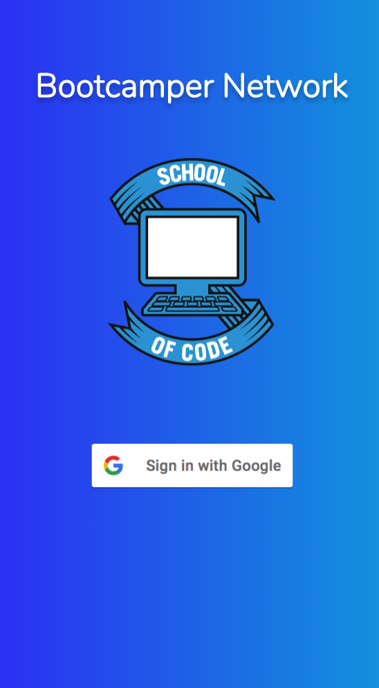
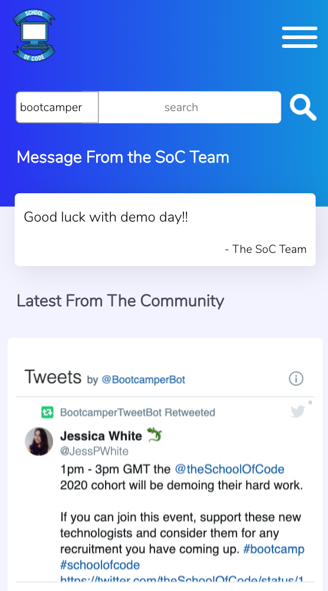
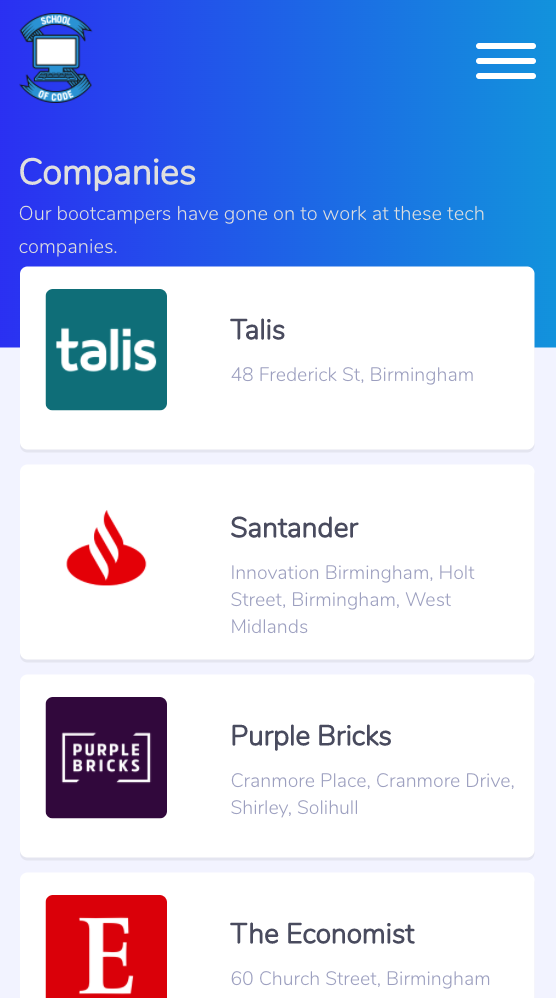

# School of Code Bootcamper Network App
## Final project for team Jomellen
### Jodie Neville, Mell Kay & Helen Kent

<table>
<td></td>
<td></td>
<td></td>
</table>

### Faced with the problem of a distributed network of current bootcampers and alumni, team Jomellen decided to bring everyone together with our Bootcamper Network App. School of Code bootcampers past and present can all now login to the app and share their career progress with each other. This enables other bootcampers to see all SoC affiliated companies easily. Bootcampers can also share (privately, with only the SoC team) their job satisfaction rating, allowing the team to reach out to support the bootcamper with a new job hunt. 

## **[Click here for the live site hosted on Netlify](https://bootcamper-network.netlify.app/)**

<table>
<td></td>
<td></td>
<td></td>
</table>

## How to use (only if you're from the School of Code!)
1) Click the link above and login with your Google account.
2) Create an account.
3) Investigate the app!

## Installation
1) Clone or download this repository and the back end repository (follow instructions for back end on the back end readme)
2) cd into the project folder.
3) Run *npm install* to download dependencies
4) Put your server URL into the .env file
5) Register your project with Google firebase authentication and input .env variables
6) Get a google maps api key and input into .env 
7) Get a meet up api pro account and enjoy the OAuth2 set up we have done for you!
8) Run *npm start* to run the app in your browser.